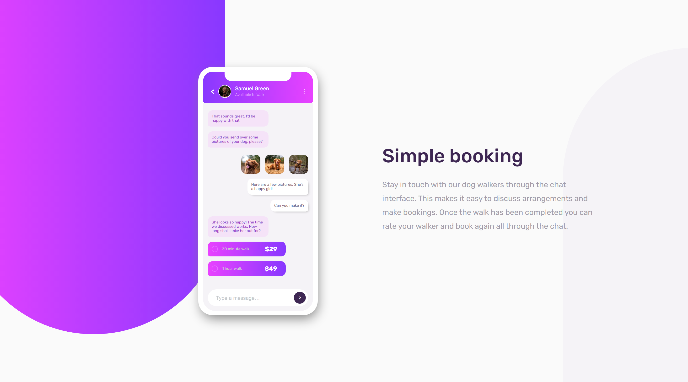
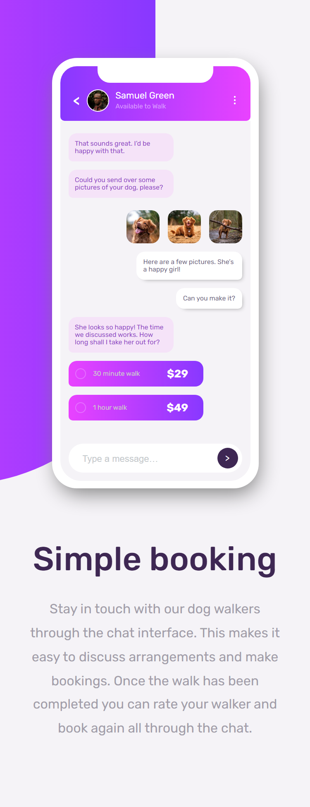

# Frontend Mentor - Chat app CSS illustration solution

This is a solution to the [Chat app CSS illustration challenge on Frontend Mentor](https://www.frontendmentor.io/challenges/chat-app-css-illustration-O5auMkFqY). Frontend Mentor challenges help you improve your coding skills by building realistic projects. 
Frontend Mentor challenges provide a jpg design of a website to code. They include a style guide (which includes the hsl values of the text and background colours, the font and font size, and the widths for mobile and desktop designs) as well as the text on page. 
I then code the site by myself from scratch. 

Difficulty: Level 3 (Intermediate)

## Overview

### The challenge

Users should be able to:

- View desktop site: 1440px width 
- View mobile site: 375px width 

## Links 

- Live Site URL: [https://jordansgit.github.io/chat-app-css-illustration/](https://jordansgit.github.io/chat-app-css-illustration/)

### Built with
- HTML5 
- CSS 

### Screenshot

Desktop 

Mobile 

